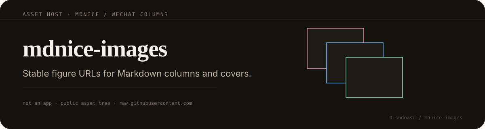

<p align="center">
  
</p>

# mdnice-images

**Image hosting for mdnice and WeChat copy-ready Markdown.**

Not an application — a public asset tree so column posts can reference **stable GitHub raw URLs** when pasting into [mdnice](https://mdnice.com/) or WeChat editors.

<p align="center">
  
</p>

| Path | Role |
|------|------|
| `synchrotron-column/` | Synchrotron / diffraction column figures and covers |
| Nested paper folders | Per-article figure packs |

### Embed

```markdown

```

Prefer descriptive filenames. Avoid overwriting assets already linked from published posts. Keep mobile-friendly file sizes.

Check provenance before reuse outside personal columns.
